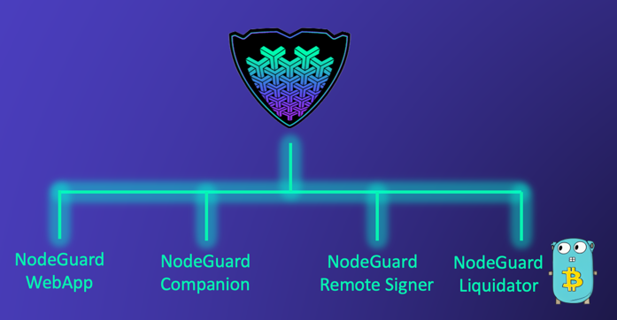

# NodeGuard


[](https://github.com/Elenpay/NodeGuard/actions/workflows/dotnet.yml)
[](https://github.com/Elenpay/NodeGuard/actions/workflows/docker.yaml)

<p align="center">
  
</p>
NodeGuard is an open-source technology stack developed to simplify treasury operations for lightning nodes, focusing on both Security and UX. It enables the management of lightning treasury funds, adhering to the principles of separation of duties and the principle of least privilege. These principles form the core of NodeGuard's functionality, aiming to eliminate the need for an internal node hot wallet and to separate key management from the actual node operators. At present, NodeGuard supports only LND. For a more detailed understanding, please watch the video below.

[](https://youtu.be/qIQ5J0npj0c)

Current features of NodeGuard are the following:

- Asynchronous channel funding leveraging cold multisig wallets and hot wallets
- Multisig wallet creation and import (BIP39), only segwit for now
- Liquidity automation by settings rules in tandem with [NodeGuard liquidator](https://github.com/Elenpay/liquidator)
- Optional remote signing through [NodeGuard Remote Signer](https://github.com/Elenpay/Nodeguard-Remote-Signer) functions for channel funding transactions, separating the NodeGuard keys from the actual software
- Automatic sweeping of funds in lightning nodes to avoid having funds on the node hot wallets
- Channel management
- Channel creation interception with returning address to multisig wallets to avoid having funds on hot wallets
- Support for hardware wallets to sign the PSBTs for channel funding transactions
- Minimalistic in-browser wallet with [NodeGuard Companion](https://github.com/Elenpay/Nodeguards-Companion) to ease signing of transactions and wallet creation
- In-browser notification systems for channel approvals
- Two-factor authentication

# Contributing
Check [Contributing.md](CONTRIBUTING.md)

# Roadmap

TODO

# Dev environment quickstart

1. Run polar regtest network with Polar, import devnetwork.zip (in the root of this repo) and start it
2. Open FundsManager.sln with Visual Studio or your favourite IDE/EDITOR
3. Set startup project to docker-compose
4. Run

##Requirements

- VS Code / Visual Studio
- Docker desktop
- Dotnet SDK 6+
- Dotnet-ef global tool
- [Polar lightning](https://lightningpolar.com/)
- AWS Lambda function + AWS credentials for the Remote FundsManagerSigner, check [this](#trusted-coordinator-signing)


## Migrations

This project uses NPGSQL(postgres) database provider for EfCore (ORM). You need to install dotnet-ef global tool
```
dotnet tool install -g dotnet-ef
```

- To update the database (create it & apply migrations) you shall do:
    ```
    cd src && dotnet ef database update
    ```
- To create a new migration
  ```
  cd src && dotnet ef migrations add changeInEntityExampleAddedNewField // This is an example
  ```
- To remove a non-applied migration (once a migration is applied, you have to drop the database to remove it)
    ```
    cd src && dotnet ef migrations remove
    ```


## Developing

### Visual Studio
Launch the FundsManager Docker VS task
Launch The FundsManager VS task

### Rider/IntelliJ
Import and start `devnetwork.polar.zip` in polar
Launch the FundsManager Docker NOVS task
Launch The FundsManager NOVS task

### Visual Studio Code
Import and start `devnetwork.polar.zip` in polar
Start docker compose from terminal (see below)
Then, start the vscode launch configuration `Launch against running docker-compose env (DEV)`
Navigate to http://localhost:38080/

### Starting docker compose from terminal
Start all the dependencies in docker-compose by running:
```bash
cd docker
docker-compose -f docker-compose.dev-novs.yml up -d
```

# Security 
Check [Security.md](SECURITY.md)

# LICENSE
This project is licensed under AGPLv3.0. Check [LICENSE](LICENSE) for more information.