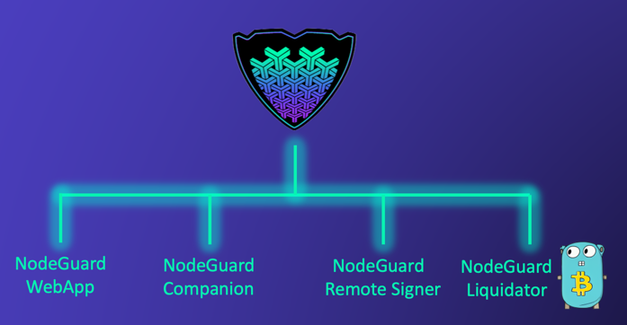

# NodeGuard


[](https://github.com/Elenpay/NodeGuard/actions/workflows/dotnet.yml)
[](https://github.com/Elenpay/NodeGuard/actions/workflows/docker.yaml)

<p align="center">
  
</p>
NodeGuard is an open-source technology stack developed to simplify treasury operations for lightning nodes, focusing on both Security and UX. It enables the management of lightning treasury funds, adhering to the principles of separation of duties and the principle of least privilege. These principles form the core of NodeGuard's functionality, aiming to eliminate the need for an internal node hot wallet and to separate key management from the actual node operators. At present, NodeGuard supports only LND. For a more detailed understanding, please watch the video below.

[](https://youtu.be/qIQ5J0npj0c)

Current features of NodeGuard are the following:

- Asynchronous channel funding leveraging cold multisig wallets and hot wallets
- Multisig wallet creation and import (BIP39), only segwit for now
- Liquidity automation by settings rules in tandem with [NodeGuard liquidator](https://github.com/Elenpay/liquidator)
- Optional remote signing through [NodeGuard Remote Signer](https://github.com/Elenpay/Nodeguard-Remote-Signer) functions for channel funding transactions, separating the NodeGuard keys from the actual software
- Automatic sweeping of funds in lightning nodes to avoid having funds on the node hot wallets
- Channel management
- Channel creation interception with returning address to multisig wallets to avoid having funds on hot wallets
- Support for hardware wallets to sign the PSBTs for channel funding transactions
- Minimalistic in-browser wallet with [NodeGuard Companion](https://github.com/Elenpay/Nodeguards-Companion) to ease signing of transactions and wallet creation
- In-browser notification systems for channel approvals
- Two-factor authentication
- Manual and automated Swap Outs

# Contributing
Check [Contributing.md](CONTRIBUTING.md)

# Roadmap

TODO

# Dev environment quickstart

Run `tilt up` to run the whole infrastructure, then `just run` to run the project.

## Requirements

- VS Code / Visual Studio
- Docker desktop
- Dotnet SDK 6+
- Dotnet-ef global tool
- AWS Lambda function + AWS credentials for the Remote FundsManagerSigner, check [this](#trusted-coordinator-signing)
- Tilt
- Docker
- (Optional) [Polar lightning](https://lightningpolar.com/)
- (Optional) Go go 1.24.3 or later (for using the interactive commands in the .justfile)


## Migrations

This project uses NPGSQL(postgres) database provider for EfCore (ORM). You need to install dotnet-ef global tool
```
dotnet tool install -g dotnet-ef
```

- To update the database (create it & apply migrations) you shall do:
    ```
    cd src && dotnet ef database update
    ```
- To create a new migration
  ```
  cd src && dotnet ef migrations add changeInEntityExampleAddedNewField // This is an example
  ```
- To remove a non-applied migration (once a migration is applied, you have to drop the database to remove it)
    ```
    cd src && dotnet ef migrations remove
    ```


## Developing

## Running the infrastructure

### Using Tilt
1. Install [tilt](https://docs.tilt.dev/install.html)
2. Run `tilt up` on your terminal

### Using docker compose

1. If you want to run a lightweight version of the project use `docker compose --profile polar up -d` on your terminal. Add `--profile loop` and `--profile mempool` if you need to run them too

### Using polar

The `polar` profile above ships a self-contained regtest network (`bitcoind` + `alice`/`bob`/`carol`, the `polar-n1-*` containers) that **replaces** the Polar app — it does not attach to a network started from it. Use one or the other, not both.

If you already have a network running in the Polar app (or any other externally-managed regtest), use the `external` profile instead. It starts only NodeGuard's own dependencies — postgres and nbxplorer — and points them at your chain:

1. Copy [.env.example](.env.example) to `.env` and set the containers to use:
   ```
   BITCOIND_CONTAINER=polar-n3-backend1
   MANAGED_NODES=polar-n3-alice,polar-n3-bob,polar-n3-carol
   ```
   `BITCOIND_CONTAINER` is the name of your running bitcoind container; `MANAGED_NODES` is the list of LND containers NodeGuard should manage. Both are reached through their **published host ports** (`docker port <container>`), so there is no need to share a docker network. Each node's env var prefix comes from the last segment of its container name (`polar-n3-alice` → `ALICE_HOST`, `ALICE_MACAROON`, `ALICE_PUBKEY`).
2. Bring the dependencies up:
   ```
   just external-up
   ```
   This resolves the bitcoind RPC/P2P host ports, starts postgres + nbxplorer against them, and runs a setup container that prepares the miner wallet NodeGuard expects. It never funds your nodes or opens channels — the topology is left alone — but it does two things to your chain:
   - Creates a wallet named `default` and leaves it as the **only loaded** wallet, because NodeGuard issues wallet RPCs without `-rpcwallet`. The unnamed wallet Polar ships gets unloaded.
   - Mines to `default` until it holds `EXTERNAL_MINE_TARGET_BTC` (default 100) of mature coin, since NodeGuard's dev seeding spends 4 × 20 BTC. On an already-halved regtest chain that can be a couple hundred blocks (`EXTERNAL_MINE_MAX_BLOCKS`, default 1000, caps it).
3. Run NodeGuard as usual (`just run` / `just watch`). [docker/extract-macaroons.sh](docker/extract-macaroons.sh) reads the same `.env`, so macaroons, TLS certs, pubkeys and endpoints come from the containers you listed.
4. `just external-down` stops postgres/nbxplorer and leaves your regtest network alone.

Caveats:
- Only nodes whose container name ends in `alice`, `bob` or `carol` are seeded automatically, because [src/Data/DbInitializer.cs](src/Data/DbInitializer.cs) has those three fixed dev slots. Any other node is still extracted to `src/nodeguard-macaroons.env` (and the script tells you so) but has to be added from the UI.
- Nothing is lost when the unnamed wallet is unloaded — reload it with `bitcoin-cli -regtest loadwallet ""` — but while NodeGuard runs use `just mine` (which honours `BITCOIND_CONTAINER`) rather than Polar's mining UI, which drives that wallet.
- `EXTERNAL_MINE_BLOCKS=0` skips all mining but still unloads the unnamed wallet, so `default` stays empty and NodeGuard's dev seeding fails when it tries to send its 20 BTC. Only use it if you fund `default` yourself.
- nbxplorer logs a `not whitelisted by your node` warning; it is harmless. Add `whitelist=<the IP from the warning>` to the node's advanced options in Polar to silence it.
- `docker compose up -d` on its own starts nothing usable — every chain service lives behind a profile. Pick `--profile polar` (in-repo network) or `--profile external` (your own).

## Running the project

### Using the terminal

1. Run `just run` to build and run the project or `just watch` for hot reload on your terminal

### Using Visual Studio Code

1. Run the Debug NG launch setting on your terminal

### Using Rider/IntelliJ

1. You can run the task `NodeGuard local debug` that is in the `launchSettings.json` from any other IDE, just make sure you run first `./docker/extract-macaroons.sh` after starting the infrastructure so NodeGuard can get the latest macaroons

## Navigating NodeGuard

1. After completing the previous steps, navigate to `http://localhost:38080` to log in


# Security 
Check [Security.md](SECURITY.md)

# LICENSE
This project is licensed under AGPLv3.0. Check [LICENSE](LICENSE) for more information.